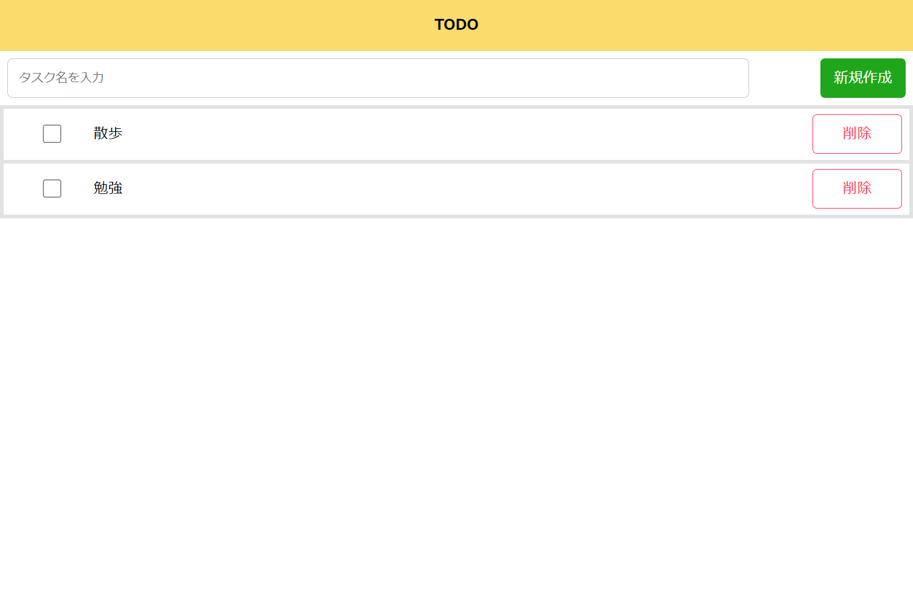

# TODO アプリ

## 機能一覧

- ### タスク の作成
- ### タスク完了のチェック
- ### タスクの削除

### このアプリは [golang-todo](https://github.com/mizore-fu/golang-todo) をバックエンドに持ちます。

## 起動方法

- `$ docker-compose build`
- `$ docker-compose up -d`
